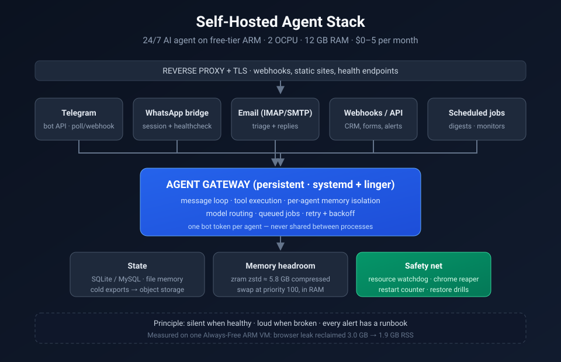

# Self-Hosted Agent Stack

**Run a 24/7 AI agent on free cloud infrastructure — no SaaS fees, no lock-in, no silent failures.**

[](LICENSE)
[](#what-this-is-not)
[](https://www.oracle.com/cloud/free/)
[](#the-real-cost)
[](https://github.com/Amz34/selfhosted-agent-stack/actions/workflows/ci.yml)

Production-tested recipes, scripts and hard-won operational lessons from running an
AI agent stack (gateway + Telegram bot + WhatsApp bridge + scheduled jobs) non-stop on a
single **free-tier ARM VM with 2 CPU cores and 12 GB RAM**.

Everything here comes from a system that is actually running — not from a tutorial.

---

> Companion list: **[Awesome Agent Infrastructure](https://github.com/Amz34/awesome-agent-infrastructure)** — 135 live-checked, self-hostable building blocks for AI agents (frameworks, memory, MCP servers, RAG, local inference, evals, free-tier infra).

## Why this repo exists

Every "run your own AI agent" guide stops at *"it works on my laptop."* The hard part
starts afterwards: the agent dies at 3 AM, the bot token returns `409 Conflict`, memory
fills up until the OOM killer takes out three services, and the free tier refuses to
scale past its quota.

This repository is the missing operational half:

- **What actually breaks** on a 12 GB / 2-core box, with measured numbers.
- **The scripts that keep it alive** — watchdogs, reapers, health checks, restart counters.
- **The free-tier envelope**, documented honestly, so you plan inside it instead of hitting it.

## Architecture



| Layer | Component | Job |
|---|---|---|
| Ingress | Reverse proxy + TLS | Routes webhooks, serves static apps |
| Core | Agent gateway (persistent, systemd + linger) | Always-on message loop, tool execution |
| Channels | Telegram, WhatsApp bridge, email, webhooks | Where humans actually talk to it |
| Work | Scheduled jobs (cron layer) | Digests, monitors, reports, follow-ups |
| Storage | SQLite / MySQL, file-based memory, compressed swap | Durable state on a small disk |
| Safety | Watchdogs + reapers + backup/restore drills | Makes the whole thing crashproof |

## Quickstart

1. **Provision the free VM** — an Always-Free ARM instance (2 OCPU / 12 GB is enough to start).
2. **Install the agent runtime** and run it under `systemd` with `loginctl enable-linger`
   so it survives logout and reboot.
3. **Create one bot per channel** — one token per bot, never shared between agents.
4. **Add the safety net first**, before you add features:
   ```bash
   sudo bash scripts/zram_setup.sh 6144          # compressed swap: RAM pressure insurance
   bash scripts/resource_watchdog.sh             # silent unless RAM/swap/disk/load is unhealthy
   bash scripts/chrome_reaper.sh --dry-run       # reclaim leaked headless-browser memory
   ```
5. **Schedule the watchdogs** (every 30 min for resources, every 2 h for the reaper),
   delivering output only when something is wrong.

## What's inside

| Path | Purpose |
|---|---|
| `docs/selfhosted-agent-stack.md` | Full build guide: host, runtime, systemd, channels, backups |
| `docs/telegram-bot-patterns.md` | Telegram bot patterns: 409 conflicts, webhook vs polling, retries |
| `scripts/zram_setup.sh` | Idempotent compressed-swap + memory-pressure sysctl setup |
| `scripts/resource_watchdog.sh` | RAM/swap/disk/load watchdog — silent when healthy, cooldown per alert |
| `scripts/chrome_reaper.sh` | Reaps leaked headless Chrome trees (only when no live client uses them) |
| `scripts/gateway_restart_cron.sh` | Restart counter + controlled gateway restarts |
| `scripts/telegram_webhook_watchdog.sh` | Detects and repairs dropped webhook registrations |
| `scripts/telegram_409_diagnose.py` | Diagnoses `409 Conflict` (two pollers on one token) |
| `scripts/whatsapp_healthcheck.sh` | WhatsApp bridge liveness + session checks |
| `scripts/gmail_toolbox.py` | IMAP mailbox operations for agent email workflows |

## Hard-won lessons (measured, not guessed)

These are the failures that cost real uptime. Each one now has a script or a documented rule.

1. **12 GB is not the limit — unmanaged memory is.** A single leaked headless-browser
   session tree held **3.0 GB**; reaping stale trees dropped usage to **1.9 GB** (−1.1 GB)
   with zero visible effect on the user. Rule: every long-running browser automation needs
   a reaper with a liveness check.
2. **Free ARM quota is a hard ceiling, not a suggestion.** On this tenancy the A1 limit is
   `2 OCPU / 12 GB`, and it was already fully consumed — a resize API call is rejected
   outright. Rule: measure your ceiling *before* designing around it.
3. **Swap alone is a trap; compressed swap is the win.** A plain 4.5 GB swap file masks
   pressure while thrashing the disk. `zram` at 50% of RAM with `zstd` gives ~5.8 GB of
   compressed swap at priority 100, in RAM, with no disk I/O.
4. **One bot token, one poller — always.** Reusing a token across two processes produces
   `409 Conflict` and a bot that silently stops answering. Diagnose with
   `scripts/telegram_409_diagnose.py`; fix by creating a separate bot per agent.
5. **A watchdog that reports "all good" daily gets ignored and deleted.** Watchdogs here
   write **nothing** when healthy and only speak when something is genuinely wrong.
6. **Backups you never restore are not backups.** A weekly restore drill into a scratch
   path is the only proof. This repo's operators run one, and it has caught real breakage.
7. **Watch the disk the boring way.** Logs, browser profiles and container images are the
   three things that quietly fill a 200 GB boot volume.

## The real cost

| Item | Free-tier allowance | Used here |
|---|---|---|
| Compute | 1× ARM instance, 2 OCPU / 12 GB | 1 instance, non-stop |
| Boot volume | 200 GB total | ~200 GB (at ceiling) |
| Outbound transfer | 10 TB / month | a few GB |
| Object storage | 10–20 GB | cold backups only |
| **Monthly bill** | — | **$0–5** (model API usage only) |

## What this is NOT

- Not a tutorial for your first chatbot — see `docs/` for that, then come back.
- Not a claim that free tier replaces paid infrastructure at scale. It replaces
  *"I pay $40/month for a server that idles at 3% CPU."*
- Not vendor-specific glue: patterns here (watchdogs, reapers, restore drills, one-token-per-bot)
  transfer to any host.

## Related projects

- [**ai-can-run**](https://github.com/Amz34/ai-can-run) — which open models your own hardware can run
- [**hermes-slack-agents**](https://github.com/Amz34/hermes-slack-agents) — one gateway, per-client agents
- [**multi-agent-research-pipeline**](https://github.com/Amz34/multi-agent-research-pipeline) — crashproof multi-agent orchestration
- [**linkedin-autopilot**](https://github.com/Amz34/linkedin-autopilot) — AI drafts, you approve, it publishes

## Contributing

Issues and pull requests are welcome — see [CONTRIBUTING.md](CONTRIBUTING.md).
If a script saved you an outage, a ⭐ helps other operators find it.

## License

MIT — see [LICENSE](LICENSE).